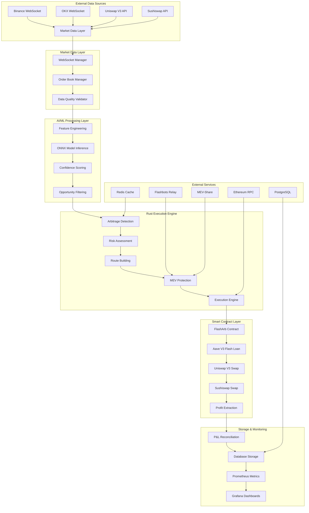
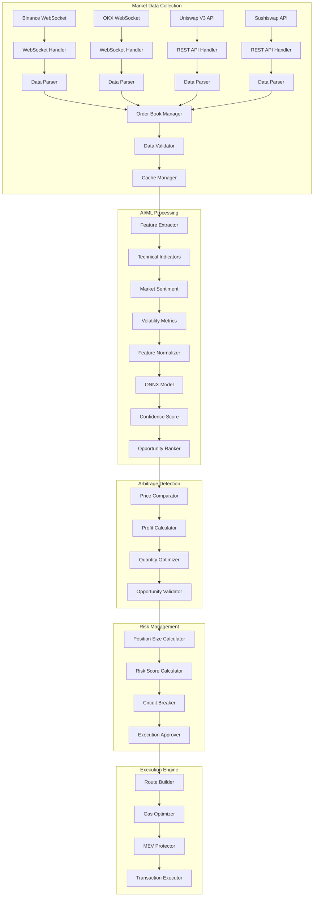
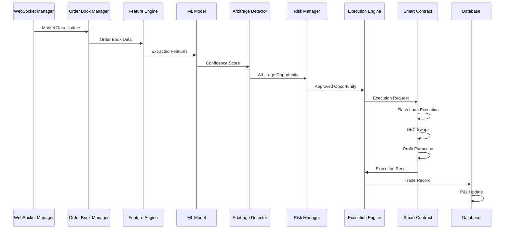
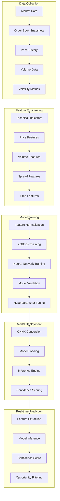
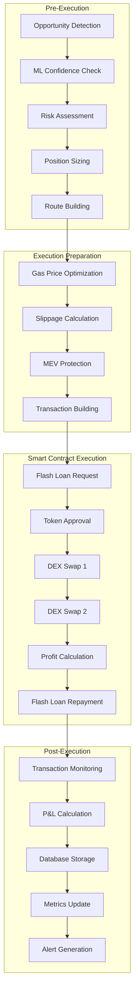
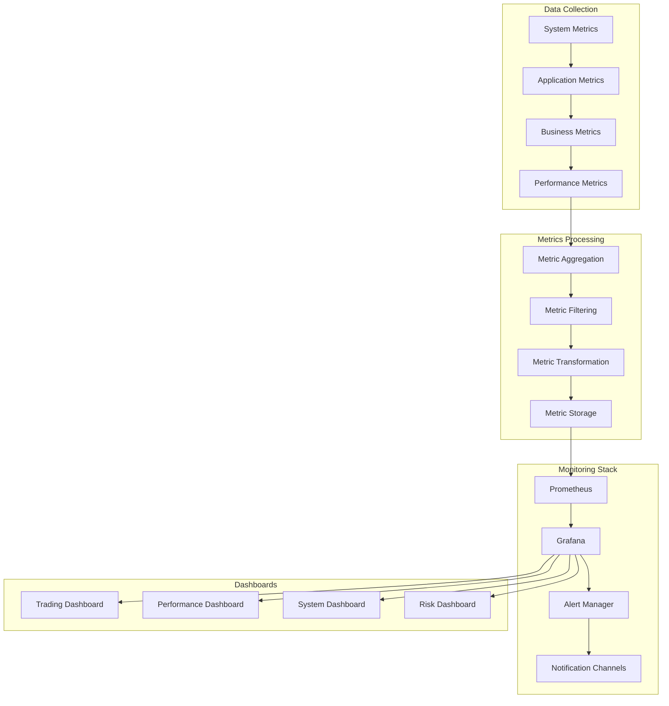
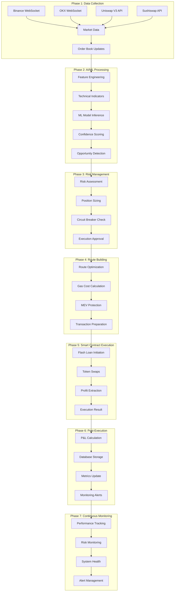

# 🔄 DEX Arbitrage System Flow Diagram

**Complete System Architecture and Data Flow Visualization**

This document provides detailed flow diagrams showing how data flows through the entire DEX arbitrage system from market data collection to profit realization.

## 📋 Table of Contents

1. [High-Level System Architecture](#high-level-system-architecture)
2. [Detailed Component Flow](#detailed-component-flow)
3. [Data Flow Sequence](#data-flow-sequence)
4. [Smart Contract Flow](#smart-contract-flow)
5. [ML Pipeline Flow](#ml-pipeline-flow)
6. [Execution Flow](#execution-flow)
7. [Monitoring Flow](#monitoring-flow)

---

## 🏗️ High-Level System Architecture



---

## 🔍 Detailed Component Flow



---

## 📊 Data Flow Sequence



---

## ⚡ Smart Contract Flow

```mermaid
graph TD
    subgraph "FlashArb Contract Execution"
        A[executeFlashArbitrage] --> B[Validate Parameters]
        B --> C[Check Authorization]
        C --> D[Validate Routes]
        D --> E[Call Aave Flash Loan]
        
        E --> F[executeOperation Callback]
        F --> G[Validate Callback]
        G --> H[Execute Arbitrage Routes]
        
        H --> I[Uniswap V3 Swap]
        H --> J[Sushiswap Swap]
        
        I --> K[Check Slippage]
        J --> K
        K --> L[Calculate Profit]
        L --> M[Validate Minimum Profit]
        M --> N[Repay Flash Loan]
        N --> O[Emit Success Event]
    end
    
    subgraph "Error Handling"
        P[Reentrancy Protection] --> Q[Access Control]
        Q --> R[Slippage Protection]
        R --> S[Emergency Pause]
        S --> T[Circuit Breaker]
    end
```



---

## 🧠 ML Pipeline Flow



---

## ⚡ Execution Flow



---

## 📊 Monitoring Flow



---

## 🔄 Complete End-to-End Flow



---

## 🎯 Key Data Flows

### **1. Market Data Flow**
```
WebSocket → Parser → Validator → Order Book → Cache → Feature Engine
```

### **2. ML Prediction Flow**
```
Order Book → Features → Normalization → ONNX Model → Confidence → Filter
```

### **3. Execution Flow**
```
Opportunity → Risk Check → Route Build → Gas Opt → MEV Prot → Execute
```

### **4. Monitoring Flow**
```
Metrics → Prometheus → Grafana → Alerts → Notifications
```

---

## 🔧 Component Interactions

### **1. WebSocket Manager ↔ Order Book Manager**
- **Data Flow**: Real-time market data
- **Frequency**: Continuous (milliseconds)
- **Data Size**: ~1KB per update

### **2. Order Book Manager ↔ Feature Engine**
- **Data Flow**: Order book snapshots
- **Frequency**: Every 100ms
- **Data Size**: ~5KB per snapshot

### **3. Feature Engine ↔ ML Model**
- **Data Flow**: Feature vectors
- **Frequency**: Every 500ms
- **Data Size**: ~1KB per prediction

### **4. ML Model ↔ Arbitrage Detector**
- **Data Flow**: Confidence scores
- **Frequency**: Every 500ms
- **Data Size**: ~100 bytes per score

### **5. Arbitrage Detector ↔ Execution Engine**
- **Data Flow**: Opportunities
- **Frequency**: On detection
- **Data Size**: ~2KB per opportunity

### **6. Execution Engine ↔ Smart Contract**
- **Data Flow**: Transaction data
- **Frequency**: On execution
- **Data Size**: ~10KB per transaction

---

## 📈 Performance Characteristics

### **Latency Targets**
- **Market Data Processing**: <1ms
- **Feature Engineering**: <5ms
- **ML Inference**: <10ms
- **Arbitrage Detection**: <5ms
- **Route Building**: <20ms
- **Smart Contract Execution**: <1000ms

### **Throughput Targets**
- **Market Data Updates**: 1000/sec
- **Feature Extractions**: 100/sec
- **ML Predictions**: 50/sec
- **Opportunity Scans**: 100/sec
- **Executions**: 10/sec

### **Memory Usage**
- **WebSocket Manager**: <50MB
- **Order Book Manager**: <100MB
- **ML Model**: <200MB
- **Execution Engine**: <50MB
- **Total System**: <500MB

---

## 🛡️ Security Considerations

### **1. Data Flow Security**
- All WebSocket connections use WSS (encrypted)
- API calls use HTTPS
- Database connections use SSL/TLS
- Internal communication uses secure channels

### **2. Smart Contract Security**
- Reentrancy protection on all functions
- Access control for sensitive operations
- Slippage protection for all swaps
- Emergency pause functionality

### **3. System Security**
- Private keys stored securely
- API keys encrypted at rest
- Rate limiting on all external calls
- Circuit breakers for protection

---

**This comprehensive flow diagram shows how data flows through the entire DEX arbitrage system, from initial market data collection to final profit realization and monitoring.**

**Happy Trading! 🚀📊**
